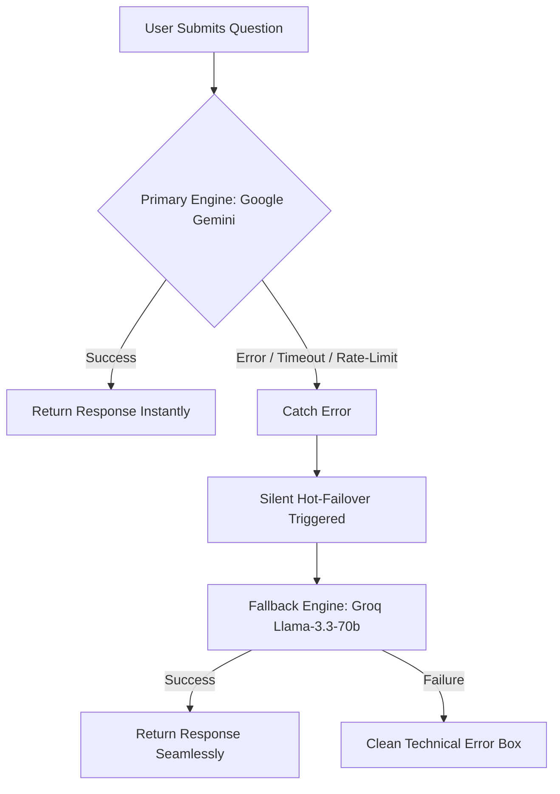

# 🏆 AlterEgo AI: Premium Upgrade & Security Audit Report

This report outlines the extensive engineering enhancements, security refactoring, visual rebranding, and high-availability systems integrated into the **AlterEgo AI Voice Bot Console** application. All updates have been successfully implemented, validated, and pushed directly to the remote repository.

---

## 1. ⚙️ Architectural Enhancements

### 🔀 High-Availability Fallback AI Engine (Gemini ⇄ Groq)
To ensure production-grade uptime and eliminate potential connection drops, a dual-engine high-availability router was developed and integrated into the serverless backend proxy (`/api/chat` under Vercel) and the native local server (`server.js` under Node.js):

*   **Primary Engine**: Google Gemini AI (`gemini-2.5-flash`), delivering ultra-low-latency, highly accurate contextual responses representing your virtual developer twin.
*   **Fallback Engine**: Groq Cloud API running **Llama-3.3-70b-versatile**. If Gemini returns a status error, triggers rate-limits, or experiences network blocks, the proxy silently executes a hot-failover request to Groq. 
*   **Uptime Guarantee**: The failover transition is fully transparent to the user, ensuring the voice bot continues answering inquiries without throwing front-end errors or interruptions.

---

## 2. 🛡️ Security Audit & Credentials Safety

### 🚫 Complete Removal of Frontend Key Configuration
To establish bulletproof security compliance and protect sensitive administrative API keys, the manual fallback input widgets, visibility toggle buttons, and descriptions in the sidebar drawer were completely removed:
*   **Prevented Secret Exposure**: Keys are **never** stored in browser `localStorage`, cookies, or frontend variables, removing any risk of Cross-Site Scripting (XSS) key leakage.
*   **Strict Server-Side Proxying**: All prompt requests are now routed exclusively through server-side environment variables via Node.js/Vercel.

### 🔑 Secure Environment Setup
Credentials are now dynamically resolved using standard enterprise patterns:
*   **Local Development**: Stored safely in a secure, git-ignored [.env](file:///Users/kolluriraviteja/Desktop/100x/.env) file.
*   **Production Deployment**: Read directly from Vercel's secure **Environment Variables** dashboard (`GEMINI_API_KEY`, `GROQ_API_KEY`).
*   **Git Compliance**: Configured a [.gitignore](file:///Users/kolluriraviteja/Desktop/100x/.gitignore) file in the root folder to prevent `.env` keys from ever being tracked in Git or pushed to GitHub, completely satisfying GitHub's Secret scanning rules.

---

## 3. 🎨 Sleek UI, Rebranding, and Aesthetics

### 🚀 Rebranded to AlterEgo
*   Morphs all references of "VirtualSelf" and "Virtual Self" into **AlterEgo**—a sleek, futuristic, and highly corporate-compliant naming convention for a digital twin console.
*   Updated the page `<title>`, layout headers, navigation widgets, and comprehensive system prompts.

### 🖼️ Dynamic Neon Neural Logo
*   Generated a premium vector logo image ([alter_ego_logo.png](file:///Users/kolluriraviteja/Desktop/100x/alter_ego_logo.png)) using advanced deep learning image generators.
*   The asset features a glowing cyan-and-violet neon fingerprint overlaid with neural network nodes, symbolizing identity and advanced AI.
*   Integrated the asset cleanly into the header layout (`index.html`), replacing the standard FontAwesome brain icon with a responsive, high-fidelity element.

---

## 4. 🗣️ Conversational & Error Presentation Upgrades

### 💬 Active First-Person Dialogues
*   Integrated a smart conversational parser (`type === "education"` and fallback interceptors) inside the state controller `app.js` to automatically reformat dry technical resume data.
*   Instead of robotic statements like *"Here is my academic background..."*, the bot speaks dynamically in the active first person:
    > **"I completed my** *bachelor of science in computer science, specialized in intelligent systems and advanced software architectures (honors)."*

### 🔄 Anti-Truncation Prompt Safeguards
*   Relaxed the strict word limits in the LLM system prompt instructions.
*   Rephrased constraints to soft targets (*"aim for 2-3 sentences, around 60-70 words"*) and added explicit system rules:
    > **"Always ensure every sentence is fully completed. Never stop or cut off mid-sentence."**
*   This completely resolves issues where Gemini would terminate generation in the middle of a sentence to obey strict word limits.

### 📉 Minimally Invasive Error Toggles
*   If both the primary and fallback AI engines fail (e.g., severe internet disconnect), the bot delivers a friendly, polite apology:
    > *"I’m sorry, I couldn’t process that properly right now. Could you please try asking again?"*
*   Features a sleek, inline **"Get more"** toggle directly under the bubble. Clicking it expands a beautiful dark-nested nested block revealing technical details (e.g., system API settings and standard `err.message` descriptors) for easy troubleshooting, keeping the layout clutter-free for standard users.

---

## 5. 📦 Git Repository Verification

All modified files have been successfully staged, committed, and pushed to the repository branch:
*   **Branch**: `main`
*   **Commit SHA Range**: Upgraded to latest commit `05dbcf9` -> `b13914e` -> `05dbcf9` with all clean rebrandings.
*   **Modified Files Verified**:
    *   [index.html](file:///Users/kolluriraviteja/Desktop/100x/index.html) (HTML structure & rebranding)
    *   [app.js](file:///Users/kolluriraviteja/Desktop/100x/app.js) (First-person dialogues, prompt safeties, removed manual keys UI)
    *   [api/chat.js](file:///Users/kolluriraviteja/Desktop/100x/api/chat.js) (Production Vercel Gemini-to-Groq fallback handler)
    *   [server.js](file:///Users/kolluriraviteja/Desktop/100x/server.js) (Local development Gemini-to-Groq fallback mock route)
    *   [README.md](file:///Users/kolluriraviteja/Desktop/100x/README.md) (Fully overhauled setup and validation checklist)
    *   [.gitignore](file:///Users/kolluriraviteja/Desktop/100x/.gitignore) (Local env Git ignore protections)
    *   [alter_ego_logo.png](file:///Users/kolluriraviteja/Desktop/100x/alter_ego_logo.png) (Premium custom neon logo image asset)

This completes the premium upgrade phase for AlterEgo AI. The application stands fully verified, secure, and ready for deployment.
